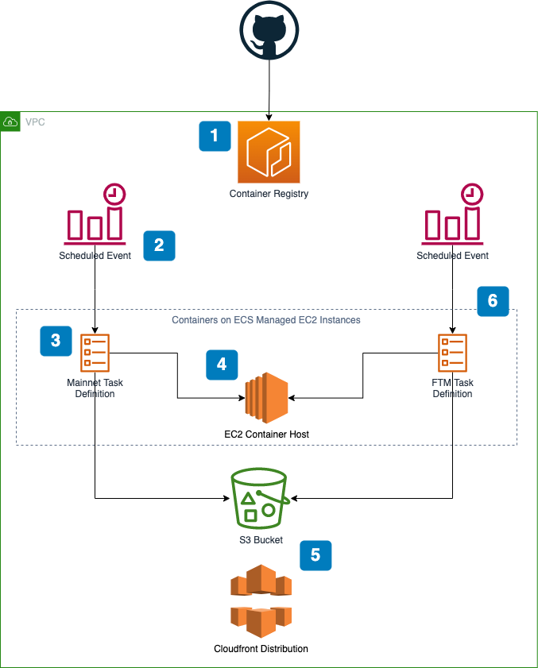

# Yearn Exporter Infrastructure

This repository contains Infrastructure as Code (IaC) for the [Yearn Exporter](https://github.com/yearn/yearn-exporter).

The infrastructure is defined using **[AWS Cloud Development Kit (AWS CDK)](https://aws.amazon.com/cdk/)**.
AWS CDK is an open source software development framework to define your cloud application resources using
familiar programming languages.

These definitions can then be synthesized to AWS CloudFormation Templates which can be deployed AWS.

Before you start you need to install **AWS CDK CLI** and bootstrap your AWS account:

1. [Prerequisites](https://docs.aws.amazon.com/cdk/latest/guide/getting_started.html#getting_started_prerequisites) 
2. [Install AWS CDK Locally](https://docs.aws.amazon.com/cdk/latest/guide/getting_started.html#getting_started_install)
3. [Bootstrapping](https://docs.aws.amazon.com/cdk/latest/guide/getting_started.html#getting_started_bootstrap)


This project is set up like a standard Python project.  The initialization
process also creates a virtualenv within this project, stored under the `.venv`
directory.  To create the virtualenv it assumes that there is a `python3`
(or `python` for Windows) executable in your path with access to the `venv`
package. If for any reason the automatic creation of the virtualenv fails,
you can create the virtualenv manually.

To manually create a virtualenv on MacOS and Linux:

```
$ python3 -m venv .venv
```

After the init process completes and the virtualenv is created, you can use the following
step to activate your virtualenv.

```
$ source .venv/bin/activate
```

If you are a Windows platform, you would activate the virtualenv like this:

```
% .venv\Scripts\activate.bat
```

Once the virtualenv is activated, you can install the required dependencies.

```
$ pip install -r requirements.txt
```

At this point you can now synthesize the CloudFormation template for this code.

```
$ cdk synth
```

To add additional dependencies, for example other CDK libraries, just add
them to your `setup.py` file and rerun the `pip install -r requirements.txt`
command.

**Useful commands**

 * `cdk ls`          list all stacks in the app
 * `cdk synth`       emits the synthesized CloudFormation template
 * `cdk deploy`      deploy this stack to your default AWS account/region
 * `cdk diff`        compare deployed stack with current state
 * `cdk docs`        open CDK documentation

## Exporter APY

### Infrastructure

The following diagram provides a high level overview of the infrastructure that this repository deploys:



[Source](https://drive.google.com/file/d/11NLPexMjvfl2rVOuGtWutYu-Ya6qVsZD/view?usp=sharing)

1. [GitHub Actions](https://github.com/yearn/yearn-exporter/actions) push container images to a container repository on AWS
2. A [CloudWatch Event](https://docs.aws.amazon.com/AmazonCloudWatch/latest/events/WhatIsCloudWatchEvents.html) triggers on a pre-defined schedule
3. The CloudWatch event launches a new Fargate container with the latest image from the container repository
4. The Fargate container mounts a persistent Elastic Files System (EFS) drive to the container. The drive contains the cache for brownie contracts between runs.
5. The output is stored in a S3 bucket and served through a cloudfront distribution
6. The same system (CloudWatch Event, Fargate Container, and EFS drive) is setup for each network (mainnet, fantom mainnet, etc...)

### Deploying

Deploy command: `cdk deploy --profile "yearn-exporter" --all --require-approval never`